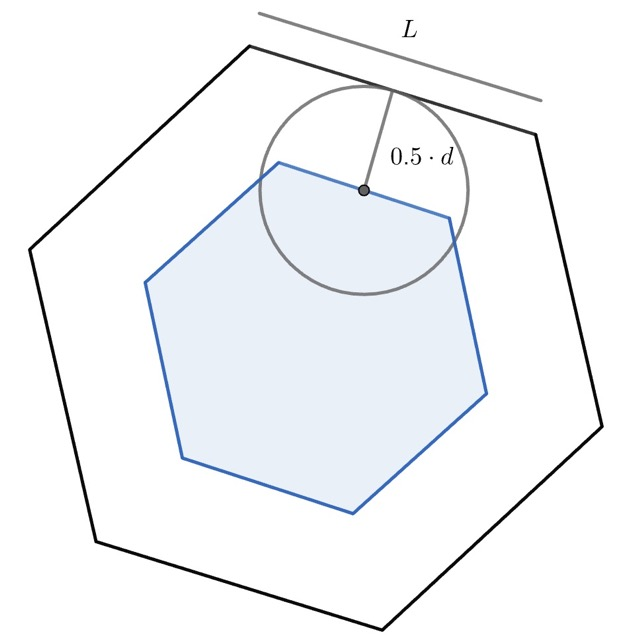
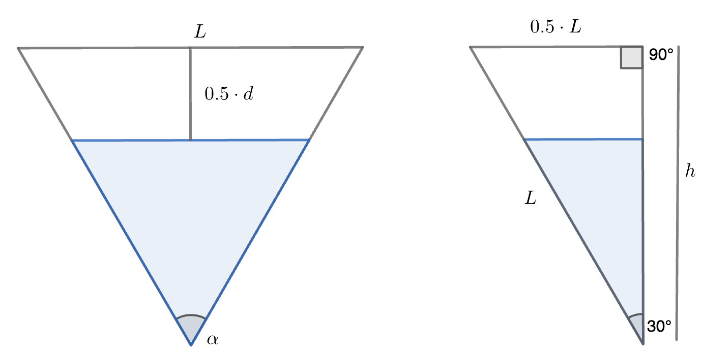
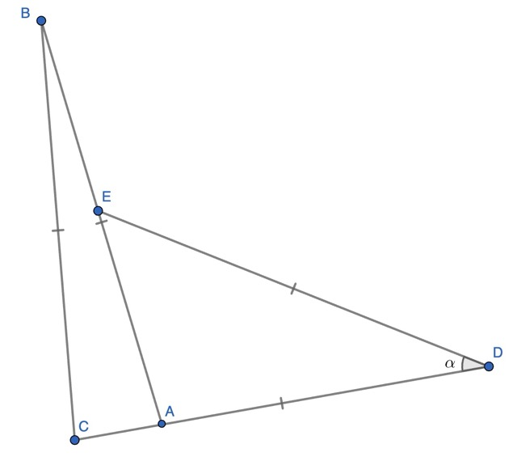
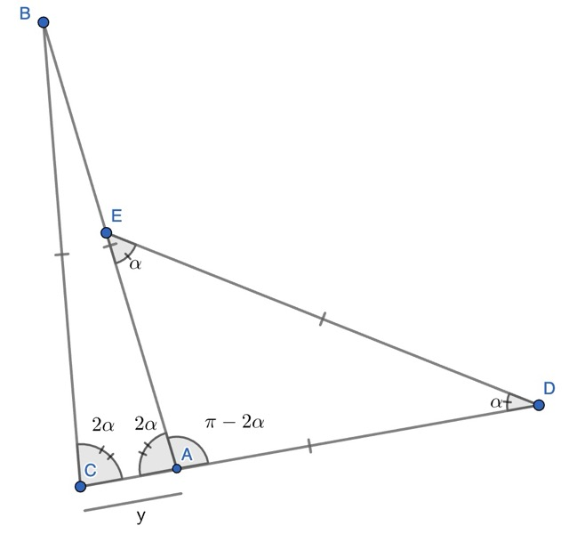
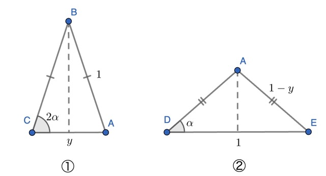
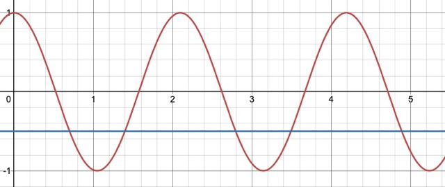
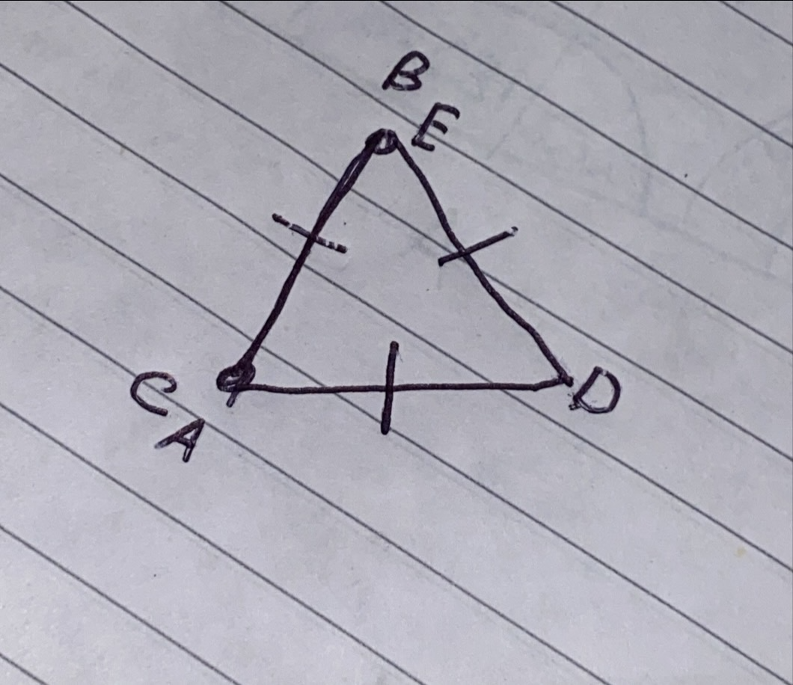

# LPA Puzzle Solutions w/c 28/10

- [LPA Puzzle Solutions w/c 28/10](#lpa-puzzle-solutions-wc-2810)
  - [Easier](#easier)
  - [Harder](#harder)
    - [Notes](#notes)

## Easier

> An infinitely large floor is tiled with regular hexagonal tiles of side length $L$. Different colours of tiles are used so that no two tiles of the same colour touch. A hoop of diameter $d$ (but negligible width) is thrown onto the tiles. **What is the chance od the hoop enclosing more than one colour?**
>
> _Professor Povey's Perplexing Problems - Thomas Povey_

_(There are quite a few ways to do this. This is the method that I think involves remembering the fewest formulae and also me having to make the fewest explanatory figures)_

We can define the question in a bit more of a mathematical way to make our lives simpler. Instead of talking about the whole hoop, we can just think about where the centre will land. We know that it will definitely land on a hexagon, and our answer doesn't change irrelevant of which hexagon that was.

So, just considering a hoop landing on a single hexagon, we can think about when that hoop would overlap the edges (i.e. enclose some other colour.) This must be when the centre is less than $0.5 \cdot d$ (the radius) away from one of the sides of the hexagon when measured at right angles. 

From here we can find the probability that the hoop will land fully _inside_ the tile by finding the area of this smaller hexagon.

Hexagons are annoying though, and helpfully this one is regular, so it's just made up of six identical triangles (draw a line from each vertex to the opposite one to see them). We can simplify things further by just considering one of the triangles:

As there must be six triangles, angle $\alpha$ must be $\frac{360}{6} = 60^\circ$, and as all of the distances from the centre to the vertices of the hexagon must be equal (otherwise it wouldn't be regular) the two sides on either side of $\alpha$ must be the same length, making this an isosceles triangle. The other two angles are therefore also $\frac{180-60}{2}=60^\circ$ and this is an equilateral triangle. 

If we bisect angle $\alpha$ and split the triangle in half, we get the second triangle in the figure, and importantly a right-angled triangle. As we have the hypotenuse and the adjacent sides to angle $\alpha$ we get that $cos(30) =  \frac{h}{L}$, i.e. $h = \frac{\sqrt{3}}{2}L$.

The smaller shaded triangle is **similar** to the outer triangle, except that instead of height $h$, it has height $(h - 0.5 \cdot d) = (\frac{\sqrt{3}}{2}L - \frac{1}{2}d)$. 

So the **length** scale factor[^1] between the large and small  is 

$$\frac{\frac{\sqrt{3}}{2}L - \frac{1}{2}d}{\frac{\sqrt{3}}{2}L} = \frac{L-\frac{\sqrt{3}}{3}d}{L}$$

**Area** scale factors are the length scale factor squared, so the small triangle has

$$ \frac{(L-\frac{\sqrt{3}}{3}d)^2}{L^2}$$

times the area of the large one.

As the whole hexagon is made up of these triangles, this must also be the ratio between the smaller hexagon and the larger one, and so this is the probability that the hoop will land inside the hexagon. We want the inverse of this, and so the solution must be 

$$P(X) = \min\{ 1 - \frac{(L-\frac{\sqrt{3}}{3}d)^2}{L^2}, 1 \}$$

## Harder

> The four rods $AB$, $BC$, $CD$ and $DE$ are of equal length and are hinged at $B$, $C$ and $D$. They lie on a flat surface in such a way that $A$ touches $CD$ and $E$ touches $AB$.
>
> Given that triangle $\Delta ADE$ is isosceles, **find angle $A\hat{D}E$.**

This is a very confusing way to write things, so we can start off by drawing a sketch to see what this is supposed to look like.[^2] 

We're looking for angle $A\hat{D}E$, which we'll label $\alpha$. By doing some angle chasing we can find the remaining angles in terms of $\alpha$:

- $A\hat{E}D = \alpha$: ($\Delta ADE$ is isosceles)
- $D\hat{A}E = \pi - 2\alpha$: ($\Delta ADE$ is isosceles)
- $B\hat{A}E = 2\alpha$: (angles on a line add to $\pi$)
- $A\hat{C}B = 2\alpha$: ($\Delta CAB$ is isosceles)

Relabeling the figure we get

Assume that all of the rods have length $1$, and label the base of triangle $\Delta ABC$ $y$. Then we can split the shape into two isosceles triangles. 

For each of these we can draw in a perpendicular bisector of the base to gain a right-angled triangle (as we did above). With some trig we get:

- $\frac{y}{2} = \cos(2\alpha)$ (from ①)
- $\frac{1}{2} = (1-y)\cos(\alpha)$ (from ②)

Rearranging the first of these to $y = 2\cos(2\alpha)$ and substituting into the second, we get

$$\frac{1}{2} = (1-2\cos(2\alpha))\cos\alpha$$

At this point it is helpful to recall the [angle sum formulae](https://filestore.aqa.org.uk/resources/mathematics/AQA-AS-A-MATHS-FORMULAE.PDF#page=4):

  **Ⓐ** $\cos(a + b) = \cos a \cos b - \sin a \sin b$
  
  **Ⓑ** $\cos(2a) = 1 - 2\sin^2a$

  **Ⓒ** $\sin(2a) = 2\sin a \cos a$

We can rewrite our equality as 

$$\frac{1}{2} = -\cos 2\alpha \cdot  \cos \alpha + \cos\alpha(1 - \cos 2\alpha)$$

From **Ⓑ** we get 

$$\frac{1}{2} = -\cos 2 \alpha \cdot \cos \alpha + \cos \alpha \cdot 2 \sin^2 \alpha$$

Take out one $\sin\alpha$

$$\frac{1}{2} = -\cos 2 \alpha \cdot \cos \alpha + \sin \alpha(2\sin \alpha \cdot \cos \alpha)$$

Then from **Ⓒ**

$$\frac{1}{2} = -\cos 2 \alpha \cdot \cos \alpha + \sin \alpha \cdot \sin 2 \alpha$$

This is just the form from **Ⓐ** though, so

$$\frac{1}{2} = -\cos(\alpha + 2\alpha) = -\cos{3\alpha}$$

From here we're home free

$$3x = \cos^{-1}-\frac{1}{2}$$

$$x = \frac{\frac{2}{3}\pi}{3} = \frac{2\pi}{9}$$

Or if you like degrees, $x = 40^\circ$.

---

### Notes

The canny among you will notice that $x=\frac{2\pi}{9}$ is not in fact the only solution to $\cos(3x) = 0.5$ as $\cos(3x)$ is sinusoidal with period $\frac{2\pi}{3}$.

 

So strictly speaking the solution to our equation is in fact the set satisfying 

$$x = \begin{cases}
\frac{2\pi}{9} + \frac{2n\pi}{3} \\
\frac{4\pi}{9} + \frac{2n\pi}{3} 
\end{cases} n \in \mathbb{Z}$$

However, there are additional requirements for our shape that haven't been baked into this equation (for example that $|AE| < |AB|$) but that we also need to consider. 

Both $x = \frac{2\pi}{9} = 40^\circ$ and $x = \frac{4\pi}{9} = 80^\circ$ allow us to construct isosceles triangles for $\Delta DEA$, but only the smaller one allows for $\Delta ABC$ to also be isosceles with base angle $2x$. You can see mangled version of the construction with different possible solutions at [this geogebra file](https://www.geogebra.org/geometry/mvjdpkd8) by messing with the slider.

---

We also can't get the degenerate solution from [^2] using the formula above. Clearly triangle $\Delta ABC$ is flat with two angles of $\frac{\pi}{2} = 90^\circ$. But angle $x$ must be $\frac{\pi}{3} = 60^\circ$, and so we no longer have the relationship between the angles in the two isosceles triangles that we made use of. It's disappointing that there doesn't seem to be a general solution that covers both cases! 

---

[^1]: The number we need to multiply all of the lengths of the large triangle by to get the corresponding lengths for the small triangle

[^2]: If we assume all of the rods have infinitesimal width, we could argue that this arrangement also fulfills the question  which gives us that $A\hat{D}E = 60^\circ$. The similar arrangement where $A$ lies on top of $D$ and $E$ on $B$ gives $A\hat{D}E = 0^\circ$. Nice work Joe! But we would also like the other solution!